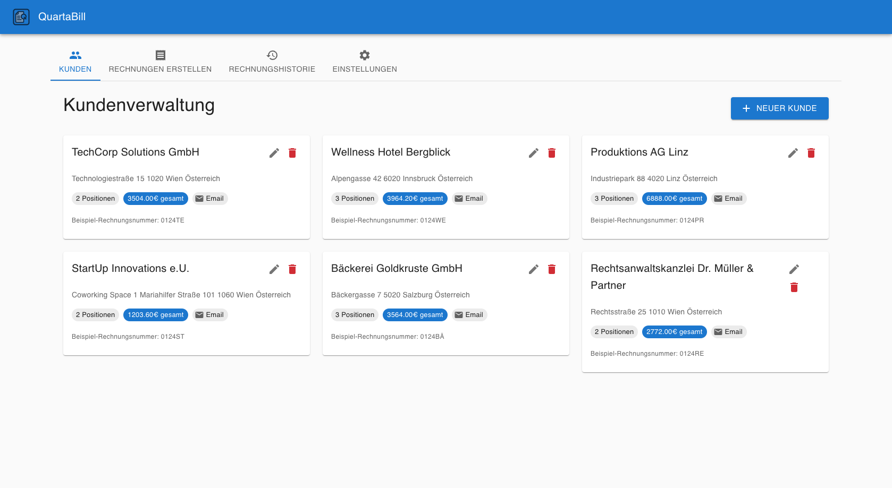

# QuartaBill Website

Eine ultramoderne Homepage für **QuartaBill** - die professionelle Desktop-App für Quartalsabrechnungen von Arbeitsmedizinern.



## 🚀 Über das Projekt

Diese Website präsentiert QuartaBill, eine speziell für Arbeitsmediziner entwickelte Desktop-Anwendung zur effizienten Quartalsabrechnung. Die Homepage wurde gemäß einem detaillierten Website-Plan entwickelt und bietet ein modernes, professionelles Design mit Glassmorphism-Effekten.

### ✨ Features der Website

- **Ultramodernes Design** mit Glassmorphism und Gradient-Effekten
- **Responsive** für alle Bildschirmgrößen optimiert
- **Animationen** mit Framer Motion
- **Performance-optimiert** mit Next.js 14
- **SEO-freundlich** mit Meta-Tags und Structured Data
- **Accessibility** nach WCAG 2.1 Standards

### 🎯 Zielgruppe

- 👨‍⚕️ Arbeitsmediziner (DACH-Region)
- 🏥 Betriebsärzte mit eigener Praxis  
- 📊 Kleine bis mittlere Arztpraxen
- 💼 Selbstständige Mediziner

## 🛠️ Tech Stack

- **Framework**: Next.js 14 (App Router)
- **Styling**: Tailwind CSS
- **Animationen**: Framer Motion
- **Icons**: Lucide React
- **Sprache**: TypeScript
- **Deployment**: Vercel (geplant)

## 🏗️ Projektstruktur

```
quartabill-website/
├── app/                    # Next.js App Router
│   ├── globals.css        # Globale Styles
│   ├── layout.tsx         # Root Layout
│   └── page.tsx           # Homepage (DE)
├── components/            # React Komponenten
│   ├── ui/               # UI Komponenten (Button, etc.)
│   ├── sections/         # Page Sections (Hero, Features, etc.)
│   └── layout/           # Layout Komponenten (Navigation, Footer)
├── public/               # Statische Assets
│   └── screenshots/      # QuartaBill Screenshots
│       ├── de/          # Deutsche Screenshots
│       └── en/          # Englische Screenshots
├── content/             # Übersetzungen
│   ├── de/             # Deutsche Inhalte
│   └── en/             # Englische Inhalte
└── lib/                # Utilities und Konfiguration
```

## 🎨 Design System

### Farbpalette

- **Primary**: #2563eb (Blue-600) - Medizinisch & Vertrauensvoll
- **Secondary**: #64748b (Slate-500) - Professional
- **Accent**: #10b981 (Emerald-500) - Success/Download CTAs
- **Neutral**: #f8fafc (Slate-50) - Background

### Typografie

- **Headlines**: Inter Bold (3rem/2.5rem responsive)
- **Sublines**: Inter Medium (1.25rem/1.5rem)
- **Body Text**: Inter Regular (1rem/1.5rem)
- **Code**: JetBrains Mono (0.875rem)

## 🚀 Development

### Voraussetzungen

- Node.js 18 oder höher
- npm

### Installation

```bash
git clone https://github.com/entttom/quartabill-site.git
cd quartabill-site
npm install
```

### Development Server starten

```bash
npm run dev
```

Öffnen Sie [http://localhost:3000](http://localhost:3000) in Ihrem Browser.

### Build für Produktion

```bash
npm run build
npm run start
```

## 📱 Website Sections

### 🎯 Hero Section
- Split-Screen Layout mit Content links und Screenshot rechts
- Animierte CTAs (Download, Screenshots, GitHub)
- Floating Background-Elemente

### ⚡ Features Section  
- 6 Feature-Cards mit Glassmorphism-Design
- Hover-Animationen und Screenshot-Previews
- Bottom CTA für Download

### 📥 Download Section
- Platform-spezifische Download-Cards (Windows, macOS, Linux)
- Echte Download-Links zu GitHub Releases
- Feature-Highlights (Signiert, Open Source, etc.)

### 🔗 Navigation
- Sticky Navigation mit Glassmorphism
- Smooth Scrolling zu Sections
- Mobile-responsive Hamburger Menu

### 📄 Footer
- Links zu GitHub, Dokumentation, Kontakt
- Copyright und Lizenz-Informationen
- Social Links

## 🌍 Internationalisierung

Vorbereitet für Mehrsprachigkeit:
- Deutsch (primär) - `/`
- Englisch (geplant) - `/en`

## 📊 Performance

Ziele:
- **Lighthouse Score**: 100/100 (Performance, Accessibility, Best Practices, SEO)
- **Core Web Vitals**: Alle Green
- **Bundle Size**: < 500KB initial load

## 🔗 Links

- **QuartaBill App**: [GitHub Repository](https://github.com/entttom/QuartaBill)
- **Releases**: [Latest Downloads](https://github.com/entttom/QuartaBill/releases)
- **Entwickler**: [Dr. Thomas Entner](https://github.com/entttom)

## 📄 Lizenz

MIT License - siehe [LICENSE](LICENSE) für Details.

---

**Entwickelt mit ❤️ für die Arbeitsmedizin**

© 2024 Dr. Thomas Entner 